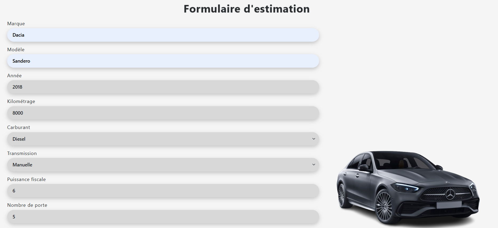
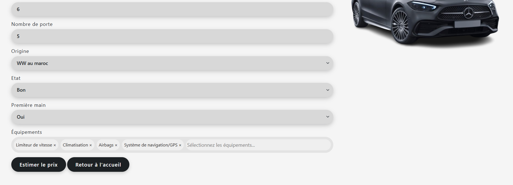
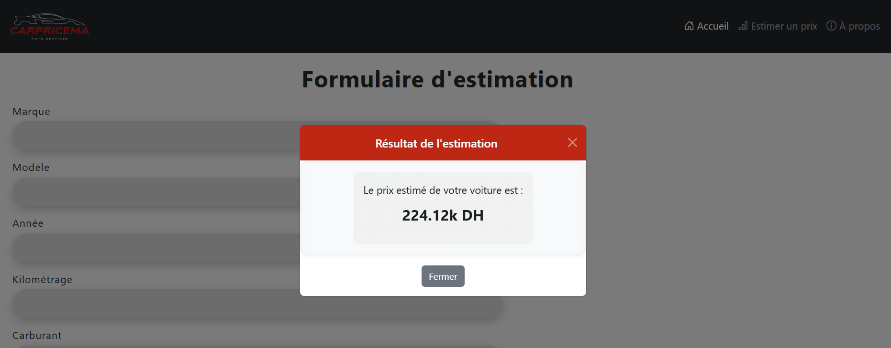

# 🧠 Project Description :
CarPriceMA is a machine learning-powered web application designed to estimate the resale value of used cars in the Moroccan market.
The app allows users to input key vehicle attributes — such as make, model, year, mileage, fuel type, and more — and receive a smart price prediction based on real market data and AI models.
The project combines data science, predictive modeling, and web development into an accessible tool for individuals or dealerships looking to assess car prices fairly and quickly.

# 🔍 Technologies Used :

**Machine Learning**
Python
Pandas, NumPy
Scikit-learn, XGBoost, Joblib

**Web Development**
Flask (backend)
HTML, CSS, JavaScript (frontend)
Jinja2 templates

**Other Tools**
Git & GitHub
VS Code
JSON (for mappings)
Virtual Environment (venv)

# 💡 How to Run Locally : 

1. Clone the repository
```python
git clone https://github.com/Rhaoufalkhadija/CarPriceMA.git
```
```python
cd CarPriceMA/app
```

2. Install the dependencies
```python
python -m venv venv
```
```python
venv\Scripts\activate 
``` 
On Windows
```python
source venv/bin/activate  
```
On Unix or MacOS
```python
pip install -r ../requirements.txt
```

3. Launch the app
python main.py

# 💻 User Interface Overview :

**Home Page**


**Estimation Form**



**Prediction Result**


# 🎯 Model Performance :

| Model             | R² (Train) | R² (Test) | Cross-Validation |
| ----------------- | ---------- | --------- | ---------------- |
| Linear Regression | 0.34       | 0.44      | 0.34             |
| Ridge / Lasso     | 0.34       | 0.44      | 0.34             |
| Random Forest     | 0.51       | 0.55      | 0.51             |
| Gradient Boosting | 1.00       | 0.90      | 0.73             |
| **XGBoost**       | **0.99**   | **0.86**  | **0.80**         |

# 🧠 Author :
**Khadija Rhaoufal** and
**Ouarrak Layla**                
Web developer & ML enthusiast from Morocco
> khadijarhaoufal@yahoo.com 
> ouarraklayla@gmail.com 